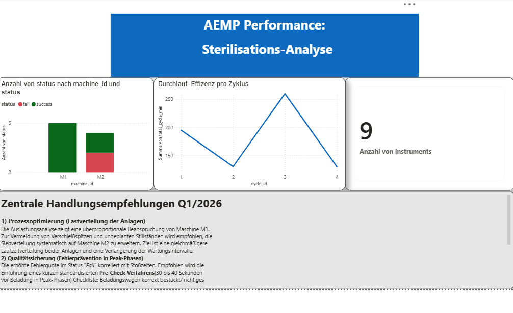
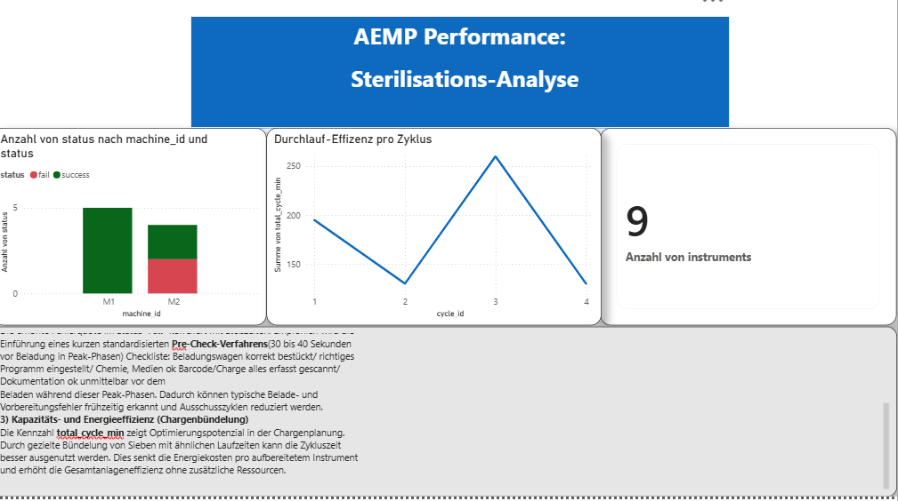

# Healthcare Sterilization Analytics Portfolio

# Fokus der Analyse 
- Prozess-Transparenz:
Verknüpfung von operativen Sterilisationsdaten aus der Datenbank mit einer visuellen Auswertung in Power BI.       - Engpass-Analyse: Identifikation von Zeitfenstern mit besonders hohem Aufkommen an Sterilisationsgut zur besseren Personalplanung.
- Datenqualität: Validierung der simulierten Prozessdaten mittels SQL-Abfragen, um eine lückenlose Dokumentation der Chargen sicherzustellen. 

---

Dieses Projekt bildet einen realistischen Sterilisationsprozess aus der AEMP (Aufbereitungseinheit für Medizinprodukte) datengetrieben ab und analysiert ihn operativ.

Ziel ist es, fachliche Prozessrealität mit Data Analytics (Python, SQL, Power BI) zu verbinden und Traceability nachvollziehbar darzustellen.

---
# Projektstruktur
- python/: 'generate_data.py' (Simulation der AEMP-Zyklen & DB-Erstellung)
- sql/: 'sterilisation_analyse.sql' (Operative SQL-Abfragen & Joins)
- data/: 'healthcare.db' (SQLite Datenbank) & 'healthcare.csv'

---

# Fachlicher Hintergrund (Praxisbezug)

In der realen Aufbereitung von Medizinprodukten reicht es nicht aus, nur den Sterilisationszyklus zu dokumentieren.

Für jede Charge müssen vollständig und nachvollziehbar dokumentiert sein:

- Alle Aufbereitungsschritte (Reinigung, Desinfektion, Kontrolle, Verpackung, Sterilisation)
- Alle enthaltenen Instrumente, Siebe und Sets
- Erfolgreicher Sterilisationszyklus (validiert, ca. 60 Minuten)
- Plateauzeit: 5 Minuten (3 Minuten Haltezeit + 2 Minuten Sicherheitszuschlag)
- Unbeschädigte Umverpackung
- Umgeschlagenes Indikatorband mit sichtbarem Farbumschlag
- Lückenlose Dokumentation im System
- Freigabe durch geschultes und zertifiziertes Personal

Nur wenn alle Anforderungen erfüllt sind, darf ein Medizinprodukt freigegeben und am Menschen angewendet werden.
Was nicht im System dokumentiert ist, gilt rechtlich und medizinisch als nicht aufbereitet.

Der Prozess ist dabei vollständig standardisiert und reproduzierbar:
Unabhängig davon, ob Mitarbeiter 1, Mitarbeiter 2 oder Mitarbeiter 3 die Charge bearbeitet — bei korrekt eingehaltenem Prozess entsteht am Ende immer das gleiche, validierte Ergebnis.

Dieses Projekt bildet genau diese Traceability und Prozesslogik datengetrieben ab.

---

# Datenpipeline (End-to-End)

1. Simulation realer Autoklav-Zyklen in Python
- Erzeugung von Sterilisationszyklen inklusive Status und enthaltenen Instrumenten
2. Berechnung der Zyklusdauer inkl. Plateauzeit
3. Auflösung der Instrumentenlisten zur Einzel-Dokumentation (Traceability)
4. Export als CSV-Datei
- Standardformat für Analysen
- direkt in Power BI ladbar
5. Speicherung in einer SQLite-Datenbank
- Relationale Datenbank ohne zusätzliche Installation
6. Analyse mit SQL-Abfragen
- Durchsatz pro Maschine: SELECT machine_id, COUNT(instruments) FROM sterilization_cycles GROUP BY machine_id;
- Durchschnittliche Zyklusdauer: SELECT status, ROUND(AVG(total_cycle_min),2) FROM sterilization_cycles GROUP BY status;
- Freigabequote: SELECT machine_id, SUM(CASE WHEN released = 1 THEN 1 ELSE 0 END) FROM sterilization_cycles GROUP BY machine_id;
7. Visualisierung in Power BI
- KPI-Karten für Freigabequote, Fehlerrate und Durchsatz
- Balkendiagramme zum Vergleich der Maschinenleistung
- Liniendiagramme für Prozessdauer und Zykluszeiten

---

# Operativer Analysefokus

Dieses Projekt ist bewusst operativ ausgerichtet (nicht strategisch). Analysiert werden unter anderem:

- Durchsatz pro Maschine (Instrumente pro Stunde)
- Fehlerquote und Reprocessing-Fälle
- Vergleich der Maschinenleistung
- Freigabequote pro Charge
- Gesamtprozessdauer bei Fehlzyklen

---

# Technologien

1. Python
Simulation und Datenaufbereitung

2. SQLite
Relationale Datenbank zur SQL-Analyse

3. SQL
Operative Kennzahlenberechnung

4. Power BI
Visualisierung und KPI-Dashboard

---

# Projektziel

Ziel dieses Projekts ist es, einen realistischen Sterilisationsprozess aus der AEMP datengetrieben abzubilden und operativ auszuwerten.

Im Fokus steht nicht die Simulation um der Simulation willen, sondern die analytische Auswertung eines medizinisch hochregulierten Prozesses anhand realitätsnaher Prozessregeln und Dokumentationspflichten.

Konkret werden folgende Fragestellungen analysiert:

Durchsatzanalyse:
- Wie viele Instrumente werden pro Maschine und Stunde tatsächlich aufbereitet?
Fehler- und Reprocessing-Erkennung:
Welche Auswirkungen haben fehlgeschlagene Sterilisationszyklen auf Prozessdauer und Kapazität?
- Vergleich der Maschinenleistung:
Gibt es Unterschiede in der effektiven Leistung der Autoklaven anhand der dokumentierten Zyklen?
- Sicherstellung der Traceability auf Instrumentenebene:
Ist jedes Instrument einer Charge lückenlos dokumentiert und darf somit freigegeben werden?

Dieses Projekt zeigt, wie ein standardisierter, reproduzierbarer medizinischer Aufbereitungsprozess in ein Datenmodell überführt, mit SQL analysiert und in Power BI visualisiert werden kann. Mit klarem Fokus auf operative Kennzahlen.

---

